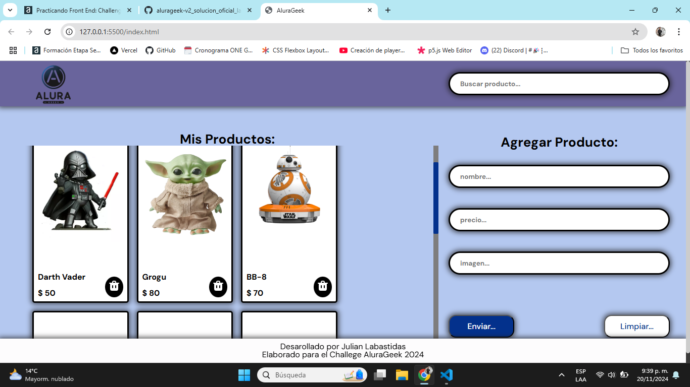

# AluraGeek

![Screenshot] 

**AluraGeek** es una aplicación web diseñada para gestionar una lista de productos, permitiendo a los usuarios **visualizar**, **agregar** y **eliminar** productos mediante tecnologías frontend modernas y un servidor JSON simulado. Desarrollada con **HTML5/CSS3**, **JavaScript (ES6 Modules)** y la **Fetch API**, implementa una conexión dinámica con una API RESTful simulada usando **json-server** para realizar operaciones **CRUD**. La metodología **BEM** garantiza un código CSS organizado, mientras que el manejo dinámico del DOM asegura actualizaciones sin recargar la página. 

Además, se creó un logo exclusivo como parte del desafío y se optimizó la responsividad, garantizando una experiencia fluida en diferentes dispositivos.

Muchas Gracias